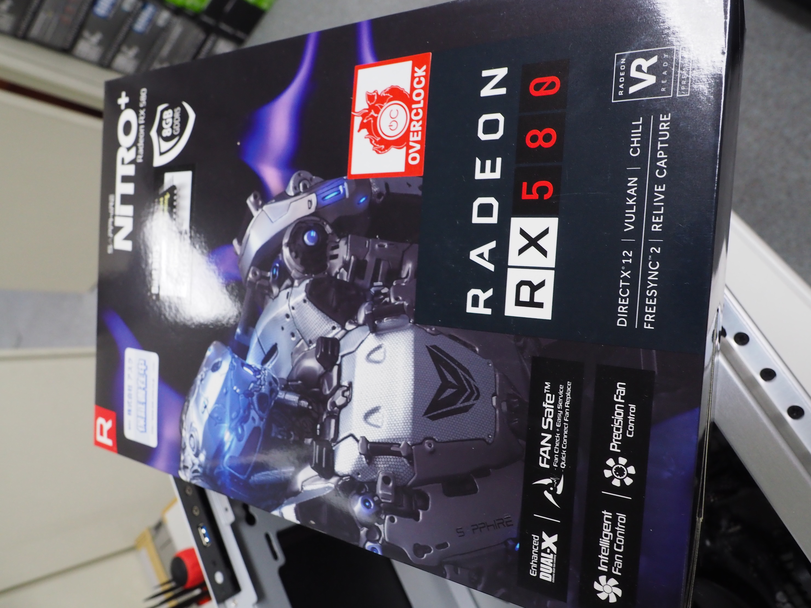
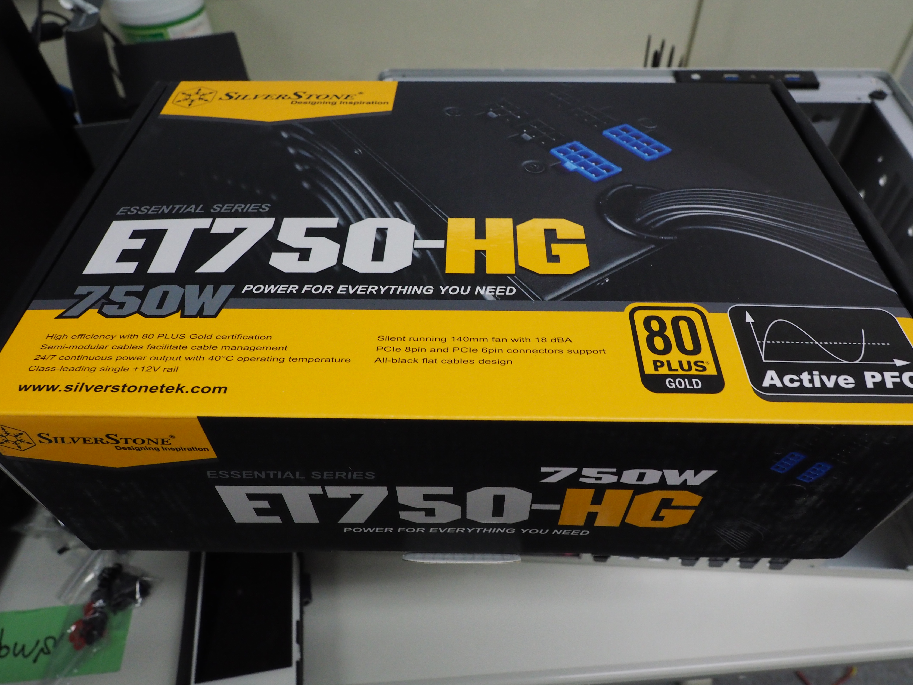

# 2019年度 計算数学PC組立実習の手順
「ソケット」「スロット」「ピン」「コネクタ」の表記ゆれがあります. ご容赦ください.

## 旧旧PCの回収, ラベルの貼替え
- (TA担当工程) 2017年度 edu\*\*b とラベリングしてあるPCを回収します.
- 2017年度edu\*\*a とラベリングしてあるPCから, ラベルを剥がし, 2019年度edu\*\*b のラベルに張り替えます. 

## 新PCの部品配布
- PCの部品を各班1組ずつ受け取ってください.
    - ケースは全部で3色あるので, 早いもの勝ちで好きなものを確保してください.
    - それ以外の部品はTAが各班に配布する予定です.
- 部品が揃っているか確認してください. 
 
|!|数量|名称|メーカー|品名|備考|
|:---|:---|:---|:---|:---|:---|
||1|CPU|AMD|Ryzen 5 2600X  with Wraith Spire cooler YD260XBCAFBOX|CPUクーラ同梱 紙箱|
||1|マザーボード|ASRock|ATX マザーボード B450PRO4|大きな箱|
||1|メインメモリ|Crucial|DDR4-2666 8GBx2枚 CT2K8G4DFS8266|2枚入り プラスチック パッケージ|
||1|SSD|WD (WesternDigital)|Black SN750 NVMe SSD  Without Heatsink 250GB  WDS250G3X0C|小さな紙箱|
||1|グラフィックボード|SAPPHIRE|Nitro+ Radeon RX 580 SA-RX580-8GD5N+001|大きな箱|
||1|電源ユニット|SilverStone|750W ATX Gold SST-ET-750HG|大きな箱|
||1|ケース|JONSBO|U4シリーズ|ダンボール箱|
左: メモリ, 中央手前: SSD, 右: CPU, 奥は上からマザーボード, グラフィックボード, 電源ユニット.

## 作業時の注意
事故防止のため, 以下にご協力をお願いいたします.  

- 足元にモノを散らかさないようにしてください.
  - ある程度は仕方ないので, 机の下を利用するなど, 各自工夫してください.
- 薄い金属板や, ガラス板を扱うので, 怪我 (切り傷) に気をつけてください.
  - 万が一怪我をした際は, TAまで申し出てください.
- 静電気によって故障してしまう可能性がありますので, ウールのセーター等は脱ぎ, 作業前に机の金属部分に触れてください.
  - 気になる方には, 静電気対策リストバンドを貸し出しています.

## 作業手順
各手順の詳細は後述するとして, 先にチェックリストを兼ねて, 手順一覧を以下に示します.  
この順番を守る必要はないのですが, この実習ではこの手順を標準とします. 

|!|番号|内容|
|:--|:--|:--|
||1|マザーボードを箱から出し, 机の上に置く.|
||2|マザーボードに, CPUおよびCPUクーラーを取り付ける.|
||3|マザーボードに, メインメモリを取り付ける.|
||4|マザーボードに, SSDを取り付ける.|
||5|ケースから箱を取り出し, マザーボード付属のIOシールドと, マザーボード取り付けのためのスペーサを取り付ける.|
||6|マザーボードをケースに取り付け, 配線をする.|
||7|グラフィックボードを取り付ける.|
||8|電源を取り付け, 配線をする.|

### マザーボードを箱から出し, 机の上に置く.

この箱を開け, 中の大きな基板を取り出します.  
スポンジが入っているので, それを下に敷き, 机の上に置きましょう.

|箱|中身|
|:---|:---|
|||

  
中の小箱に入ってるもののうち, 銀色の薄い板（IOシールド)と, スペーサ・ネジ (SSD取付用) は後で使います.  

他の付属品 (左半分) は使いません.  
わかりやすいよう, 写真の向きは統一しますが, 作業しやすい向きで作業してください.

名前と場所の対応がわからなくなったら, 以下の図を参考にしてください. (表記ゆれあります. すみません.)

### マザーボードに, CPUおよびCPUクーラーを取り付ける.
1. CPUソケット周辺に2個ついている, プラスチック製マウンタを取り外します.
2. CPUソケットの下側のレバーを起こし, CPUをソケットに取り付けます. 正しい向きで置けば, 置くだけでスッと入るはずです.
3. CPUの上に, CPU付属のクーラーを取り付けます.
4. CPUクーラーのファン (CPUファン) の電源ケーブルを, マザーボード右上のCPUファンコネクタに繋ぎます.

### マザーボードに, メインメモリを取り付ける.
メモリをパッケージから取り出してください.  
故障の原因になりますので, __金色の端子部分には触れない__ようにお願いします.   
一番右と、右から3番目のメモリスロットに, メモリを取り付けます.  

取り付けの手順は,  

1. 取り付けるスロットの上側のツメを外側に倒します.
1. メモリの切り欠きと, スロットの切り欠きをあわせて押し込みます.
2. 上側のツメがもとに戻り, スロットの上下から「カチッ」と音が鳴れば完了です.
(スロットのツメを外側に倒すことによって, 取り外しが可能です.)

この図はメモリの面が逆になっています.

### マザーボードに, SSDを取り付ける.
マザーボードの箱に入っていた小箱から, 写真のネジを取り出してください.  

M.2スロット (マザーボード中央) に, SSDを取り付けます.

取り付けの手順は, 

2. SSDの切り欠きを, スロットの切り欠きに合わせて, 斜め上から軽く, 止まるまで差し込みます.
3. SSDを倒し, マザーボードと平行な向きにし, ネジでスペーサにやさしく固定します. このとき, ドライバーは細いものを使ってください.
4. 大きなガタツキがないことを確認して完了です.

|差し込み|OK|
|:---|:---|
|||

(逆の手順で, 取り外しが可能です.)

### ケースから箱を取り出し, マザーボード付属のIOシールドと, マザーボード取り付けのためのスペーサを取り付ける.
 __怪我注意__  
 まず, 左側面のガラス板と, その内側のアルミパネルを取り外してください  
 (アルミパネルを外していない写真)
 
 
1. マザーボード付属のIOシールド (銀色の薄い穴あき金属板) を, ケースの内側から, ケース背面の四角い穴にはめてください.
  - 向きはそこにマザーボードを固定することを考えて, 判断してください.
  - はまりにくいのでがんばってください.
  - 向きを間違えたら外側から押せば取れます.
  
  |内側|外側|
  |:---|:---|
  |||
2.  ケース付属の小箱から, スペーサを7個取り出し, 下図のネジ穴に取り付けてください.
  - スペーサは, 手で強めに締めてください.
  - マザーボードのネジ穴と照合しつつ作業するのが一般的ではありますが, 今回同じものをたくさん組み立てるため, 答えを先に用意してます.  
  
  銀色のものがスペーサです.
  

### マザーボードをケースに取り付け, 配線をする.
1. IOシールドに, マザーボードのIOポートが合うように, マザーボードをスペーサの上においてください.
    - このとき, すべてのポートが背面側からアクセスできることを確認してください.
2. 7本のネジで, マザーボードを固定してください.
    - 数種類ネジがありますが, スペーサと同じ袋に入っていたネジです.
    - インチピッチの小さいネジならOKです.
    - あまり強く締めないようにお願いします. (分解する際に, スペーサごと抜けてしまうため)
    
    
3. フロントパネルUSB, オーディオ, 電源スイッチ, 電源LED, HDDアクセスLEDのケーブルがケースから伸びてますので, マザーボードに繋いでください.   
    - それぞれ図示するポートに繋いでください. 一応マザーボードに書いてあります.
    - 狭いので頑張ってください.
    - 接続を間違えても壊れないとは思います.
    - (電源スイッチ以外は繋がなくても動きます.)
    
    
    
4. ケースファンを, マザーボードのファンコネクタに繋いでください.
    

### グラフィックボードを取り付ける.
- PCI-express スロットの, 上から2番目 (長いもの上側) にグラフィックボードを取り付けます.
    - ケース背面側の, 拡張スロットを抑えている金具のネジを緩めて, マザーボードから離す方向に動かしてください.
    - 拡張スロットカバーの, 上から2番目, 3番目を取り外してください.
    
    このような状態になっていればOKです.
    
    
    - グラフィックボードを箱から出してください.
    
    - マザーボードのPCI Expressスロットのツメ(下図)が倒れていることを確認してください. 起き上がっていたら, 倒してください.  
    - グラフィックカードを, スロットにまっすぐ, ツメが起き上がるまで差し込んでください.
        - ツメが起き上がった状態で引っ張らないでください. スロットが壊れます.
    
- グラフィックボードを, ケースにネジで固定してください.
    - ネジ穴位置があわないと思うので, ケースを引っ張って頑張って合わせてください.
- 最初に動かした, スロットを抑えている金具をもとに戻してください.

|内側|外側|
|:---|:---|
|||

### 電源ユニットの取り付け
- 電源を箱から取り出してください.

|箱|内容物|
|:---|:---|
|||

- ケースに写真の向きで取り付けてください.
    - ケース背面側からネジ4本で固定してください. ネジは電源に付属しています. 太いドライバーを使用してください.
    
    |内側|外側|
    |:---|:---|
    |||
- マザーボードに, 24ピンの大きなコネクタと, 8ピンのコネクタを繋いでください.
    - 24ピンは20ピンと4ピンの分割, 8ピンは4ピン2つの分割ができるようになっているので, 合体した状態で繋いでください.
    
    |||
    |:---|:---| 
    |||
- グラフィックボードに, 8ピンと6ピンのPCIe用コネクタを接続してください.
    - 電源の袋に入っている青色のコネクタがついたケーブルを使ってください.
    
    |ケーブル|グラフィックボード側|電源ユニット側|
    |:---|:---|:---|
    ||||
    
全部終わったら, 配線がファンに引っかかっていないことを確認してから, 蓋を閉じてください.

       