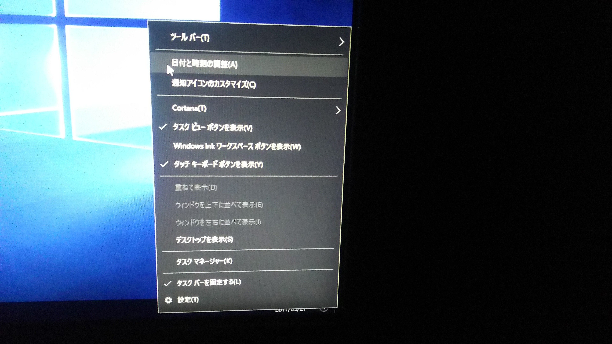

# ネットワークの設定
Windows 10 を実習環境で利用するために、以下のような設定を行う。
この実習は手際よく行えば5分程度で終了する。

## 1. プロキシの設定

この実習環境においては、PC をインターネットにつなげる場合、プロキシサーバを利用する。

1. スタートメニューから歯車のアイコンをクリックする。
2. ネットワークとインターネット」→「プロキシ」を選択して、「手動プロキシ セットアップ」までスクロールする。
3. 「プロキシサーバーを使う」にチェックを入れる。
4. 「アドレス」欄に「cache.ks.prv」、「ポート」欄に「8080」、すぐ下の大きな欄に「127.0.0.1;*.ks.prv」と入力する。

5. 「ローカル（イントラネット）のアドレスにはプロキシ サーバーを使わない」にチェックを入れる。
6. 一番下にある「保存」ボタンをクリックして設定を保存し、「設定」ウィンドウを閉じる。
7. ms.u-tokyo.ac.jpを開き, ネットワークに繋がることを確認する.

## 2.  時刻の設定
1. タスクバー右下の時計を右クリックし、出てきた「日付と時刻の調整」をクリックする。

2. 「日付と時刻」画面の右側にある「別のタイムゾーンの時計を追加する」をクリックする。
3. 「インターネット時刻設定」のタブをクリックし、「設定の変更...」ボタンをクリックする。  
4.  サーバーに master.ks.prv を入力する。  
5.  「今すぐ更新」をクリックする。  
6.  1 回目にクリックすると「同期中にエラーが発生しました。」と出る可能性があるが、そうなった場合はもう一度「今すぐ更新」をクリックする。  
7.  「時刻は正常に……同期しました。」と表示されるのを確認し OK を2回クリックする。  
8.  「設定」のウィンドウを閉じる。